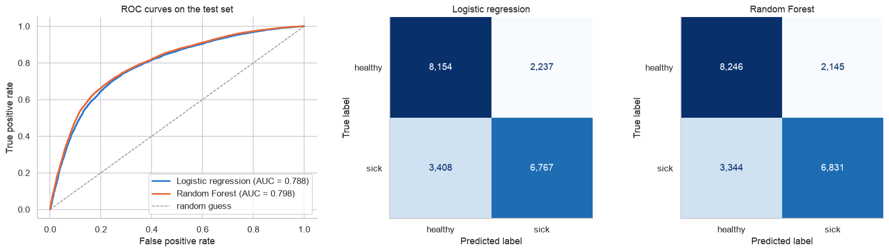
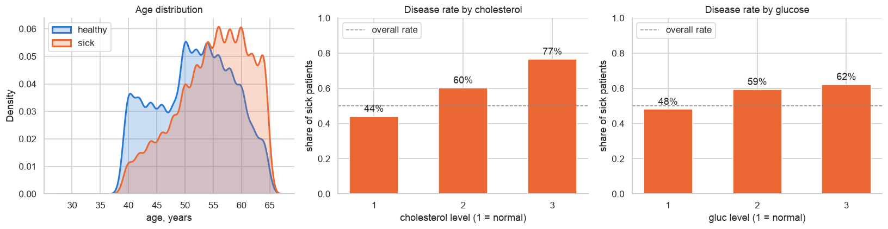
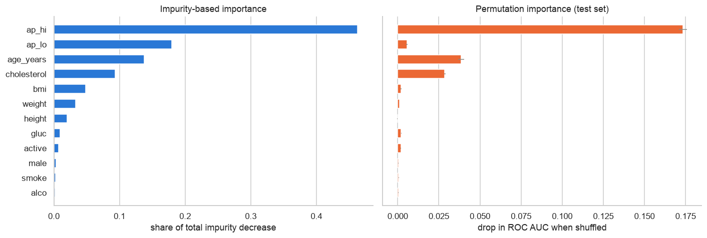
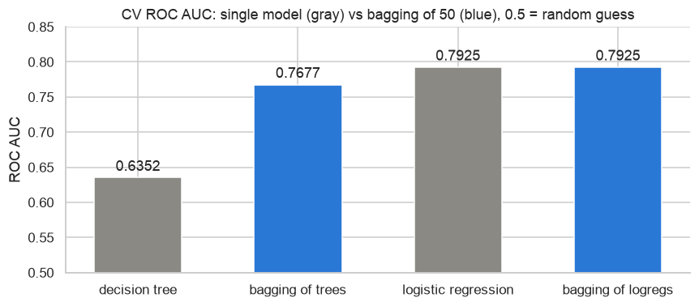

# Predicting Cardiovascular Disease

A practice project on **binary classification** from my ML learning path ([mlcourse.ai](https://mlcourse.ai), topics on
logistic regression, bootstrap, bagging and Random Forest).

Given basic medical data about a patient (age, blood pressure, cholesterol, etc.), I predict whether they have a
cardiovascular disease. I went through the full workflow: exploratory analysis → feature engineering → data cleaning →
bootstrap → logistic regression → Random Forest → test evaluation → feature importance → bagging experiment.

**Result:** a tuned Random Forest reaches **ROC AUC 0.798** on the held-out test set, versus **0.788** for logistic
regression.

The full analysis with code and charts is in
[`cardiovascular_disease_prediction.ipynb`](cardiovascular_disease_prediction.ipynb).

## Data

[`mlbootcamp5_train.csv`](https://raw.githubusercontent.com/Yorko/mlcourse.ai/main/data/mlbootcamp5_train.csv) from
mlcourse.ai: **70 000 patients**, 11 features, balanced target (50% / 50%).

| Feature | Meaning |
|---|---|
| `age` | age in days |
| `gender` | 1 = female, 2 = male |
| `height`, `weight` | cm, kg |
| `ap_hi`, `ap_lo` | systolic / diastolic blood pressure |
| `cholesterol`, `gluc` | 1 = normal, 2 = above normal, 3 = well above normal |
| `smoke`, `alco`, `active` | self-reported binary flags |
| **`cardio`** | **target**: 1 = has a cardiovascular disease |

## What I did

1. **Feature engineering:** converted age to years, added `bmi` = weight / height², turned gender into a binary `male` flag.
2. **Cleaning:** removed physically impossible records (pressure of −150 or 16 020, 55 cm height, diastolic > systolic).
   68 553 rows (97.9%) remained.
3. **EDA:** disease rate by age, cholesterol, glucose and pressure; correlation matrix.
4. **Bootstrap:** 95% confidence intervals for the mean systolic pressure of sick and healthy patients.
5. **Train / test split:** 70 / 30, stratified. All tuning used 5-fold `StratifiedKFold` on train only; the test set
   was used once at the end.
6. **Logistic regression:** `StandardScaler` + `LogisticRegression` in a `Pipeline`, `C` tuned with `GridSearchCV`,
   coefficients interpreted as odds ratios.
7. **Random Forest:** diagnosed overfitting of the default model, then tuned `max_depth`, `min_samples_leaf`,
   `max_features`.
8. **Evaluation:** ROC AUC, ROC curves, accuracy and confusion matrices on the test set.
9. **Feature importance:** impurity-based vs permutation importance.
10. **Bagging experiment:** single tree vs bagged trees, logistic regression vs bagged logistic regressions.

## Results

| Model | CV ROC AUC | Test ROC AUC |
|---|---|---|
| **Random Forest (tuned: depth 10, leaf 10, max_features 4)** | **0.8010** | **0.7980** |
| Logistic regression (tuned, C = 0.1) | 0.7925 | 0.7881 |
| Bagging of 50 logistic regressions | 0.7925 | — |
| Random Forest (default) | 0.7747 | — |
| Bagging of 50 decision trees | 0.7677 | — |
| Single decision tree | 0.6352 | — |



### Key findings

- **Blood pressure, age and cholesterol drive the risk.** Mean systolic pressure is ~134 mmHg for sick vs ~120 for
  healthy patients, and the bootstrap 95% intervals ([133.69, 134.05] vs [119.48, 119.74]) do not overlap.
  Being 10 years older multiplies the odds of disease by ≈ 1.67.

  

- **The default Random Forest overfits:** ROC AUC 1.0 on train vs 0.775 on CV. Limiting depth and leaf size fixed it
  (CV 0.801, test 0.798). CV and test scores agree, so the cross-validation estimate was honest.
- **The forest beats logistic regression by only ~0.01** because the main dependencies are close to monotonic
  (higher pressure → higher risk), which a linear model already captures well.
- **Model weights show association, not causation:** `smoke` and `alco` got negative weights in the logistic
  regression, most likely because these flags are self-reported and unreliable.
- **Impurity importance overrates correlated features.** `ap_lo` looks like the 2nd most important feature by impurity
  but is almost useless by permutation importance, because it duplicates `ap_hi` (correlation 0.73).

  

- **Bagging helps high-variance models only:** a single tree goes from 0.635 to 0.768 when bagged, while bagging
  logistic regressions gives exactly 0 improvement, since logistic regression is already stable.

  

## Tech stack

Python 3.12 · pandas · NumPy · scikit-learn · Matplotlib · seaborn · Jupyter

## How to run

```bash
pip install numpy pandas scikit-learn matplotlib seaborn jupyter
jupyter notebook cardiovascular_disease_prediction.ipynb
```

The dataset is downloaded directly from GitHub, so no local files are needed. The full run takes a few minutes
(mostly the Random Forest grid search).
